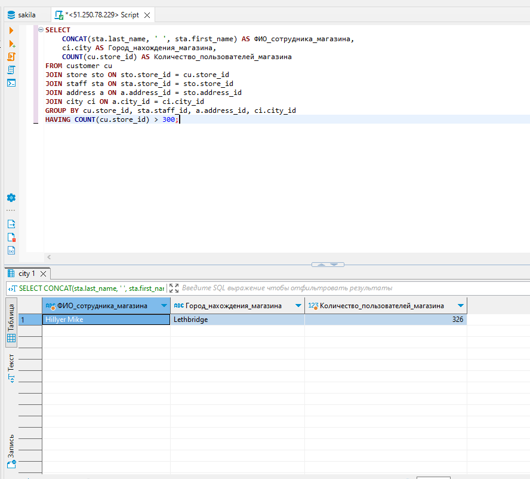
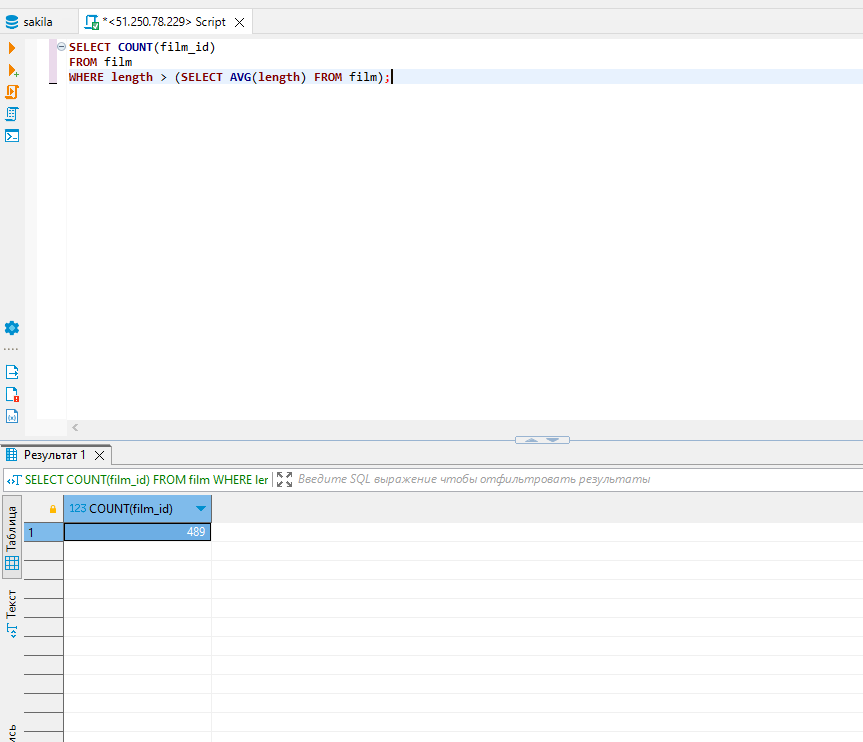
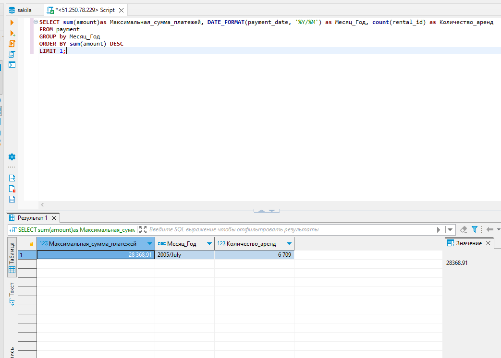
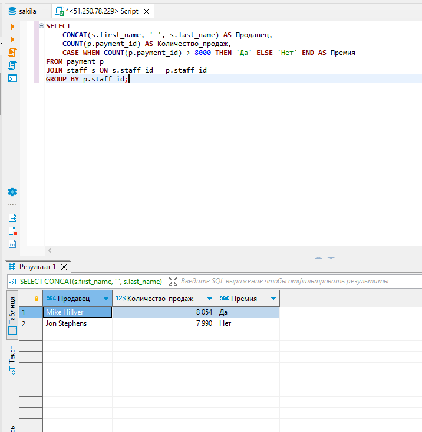
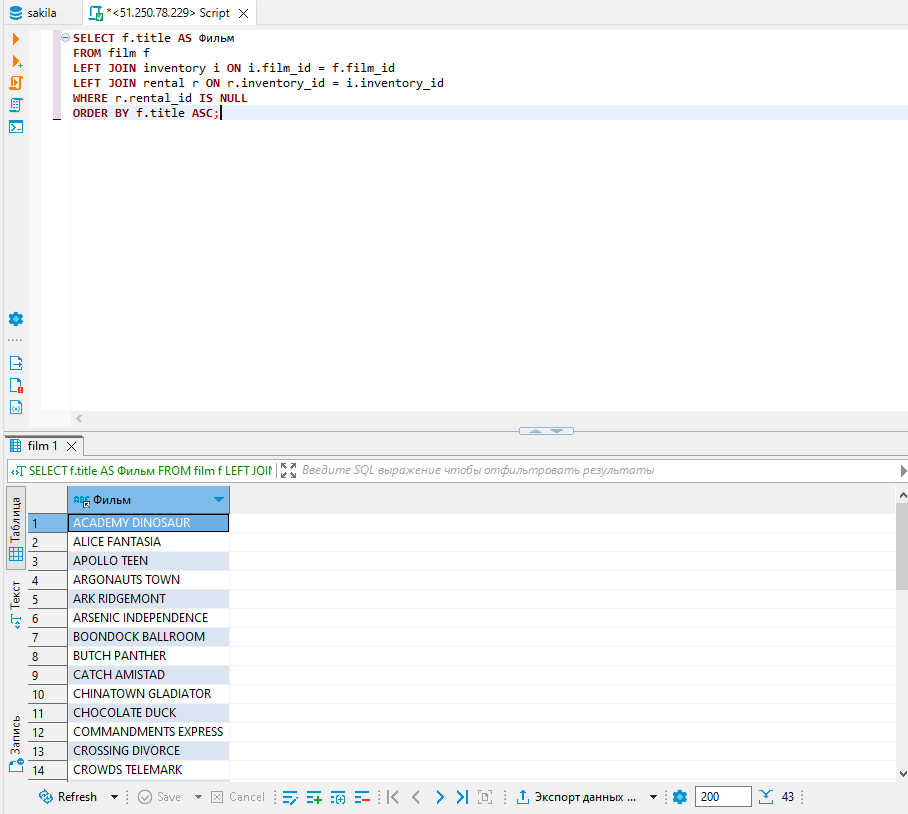

# Домашнее задание к занятию «SQL. Часть 2»

### Инструкция по выполнению домашнего задания

1. Сделайте fork [репозитория c шаблоном решения](https://github.com/netology-code/sys-pattern-homework) к себе в Github и переименуйте его по названию или номеру занятия, например, https://github.com/имя-вашего-репозитория/gitlab-hw или https://github.com/имя-вашего-репозитория/8-03-hw).
2. Выполните клонирование этого репозитория к себе на ПК с помощью команды `git clone`.
3. Выполните домашнее задание и заполните у себя локально этот файл README.md:
   - впишите вверху название занятия и ваши фамилию и имя;
   - в каждом задании добавьте решение в требуемом виде: текст/код/скриншоты/ссылка;
   - для корректного добавления скриншотов воспользуйтесь инструкцией [«Как вставить скриншот в шаблон с решением»](https://github.com/netology-code/sys-pattern-homework/blob/main/screen-instruction.md);
   - при оформлении используйте возможности языка разметки md. Коротко об этом можно посмотреть в [инструкции по MarkDown](https://github.com/netology-code/sys-pattern-homework/blob/main/md-instruction.md).
4. После завершения работы над домашним заданием сделайте коммит (`git commit -m "comment"`) и отправьте его на Github (`git push origin`).
5. Для проверки домашнего задания преподавателем в личном кабинете прикрепите и отправьте ссылку на решение в виде md-файла в вашем Github.
6. Любые вопросы задавайте в чате учебной группы и/или в разделе «Вопросы по заданию» в личном кабинете.

Желаем успехов в выполнении домашнего задания.

---

Задание можно выполнить как в любом IDE, так и в командной строке.

### Задание 1

Одним запросом получите информацию о магазине, в котором обслуживается более 300 покупателей, и выведите в результат следующую информацию: 
- фамилия и имя сотрудника из этого магазина;
- город нахождения магазина;
- количество пользователей, закреплённых в этом магазине.

```
SELECT
    CONCAT(sta.last_name, ' ', sta.first_name) AS ФИО_сотрудника_магазина,
    ci.city AS Город_нахождения_магазина,
    COUNT(cu.store_id) AS Количество_пользователей_магазина
FROM customer cu
JOIN store sto ON sto.store_id = cu.store_id
JOIN staff sta ON sta.store_id = sto.store_id
JOIN address a ON a.address_id = sto.address_id
JOIN city ci ON a.city_id = ci.city_id
GROUP BY cu.store_id, sta.staff_id, a.address_id, ci.city_id
HAVING COUNT(cu.store_id) > 300;
```



### Задание 2

Получите количество фильмов, продолжительность которых больше средней продолжительности всех фильмов.

```
SELECT COUNT(film_id)
FROM film
WHERE length > (SELECT AVG(length) FROM film);
```



### Задание 3

Получите информацию, за какой месяц была получена наибольшая сумма платежей, и добавьте информацию по количеству аренд за этот месяц.

```
SELECT sum(amount)as Максимальная_сумма_платежей, DATE_FORMAT(payment_date, '%Y/%M') as Месяц_Год, count(rental_id) as Количество_аренд
FROM payment
GROUP by Месяц_Год
ORDER BY sum(amount) DESC
LIMIT 1;
```



## Дополнительные задания (со звёздочкой*)
Эти задания дополнительные, то есть не обязательные к выполнению, и никак не повлияют на получение вами зачёта по этому домашнему заданию. Вы можете их выполнить, если хотите глубже шире разобраться в материале.

### Задание 4*

Посчитайте количество продаж, выполненных каждым продавцом. Добавьте вычисляемую колонку «Премия». Если количество продаж превышает 8000, то значение в колонке будет «Да», иначе должно быть значение «Нет».

```
SELECT
    CONCAT(s.first_name, ' ', s.last_name) AS Продавец,
    COUNT(p.payment_id) AS Количество_продаж,
    CASE WHEN COUNT(p.payment_id) > 8000 THEN 'Да' ELSE 'Нет' END AS Премия
FROM payment p
JOIN staff s ON s.staff_id = p.staff_id
GROUP BY p.staff_id;
```



### Задание 5*

Найдите фильмы, которые ни разу не брали в аренду.

```
SELECT f.title AS Фильм
FROM film f
LEFT JOIN inventory i ON i.film_id = f.film_id
LEFT JOIN rental r ON r.inventory_id = i.inventory_id
WHERE r.rental_id IS NULL
ORDER BY f.title ASC;
```


